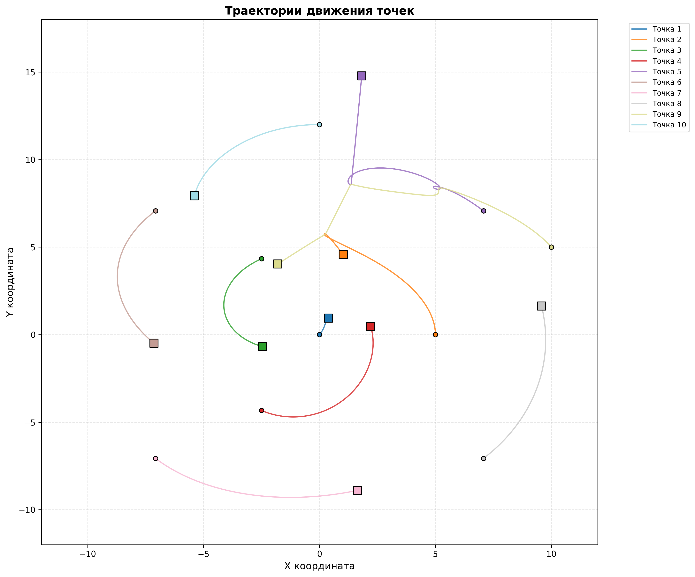
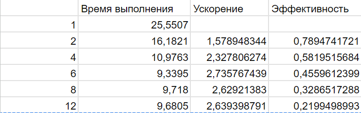
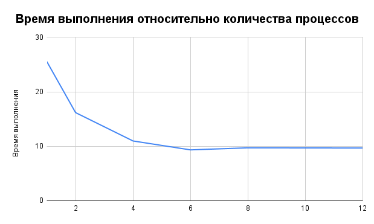
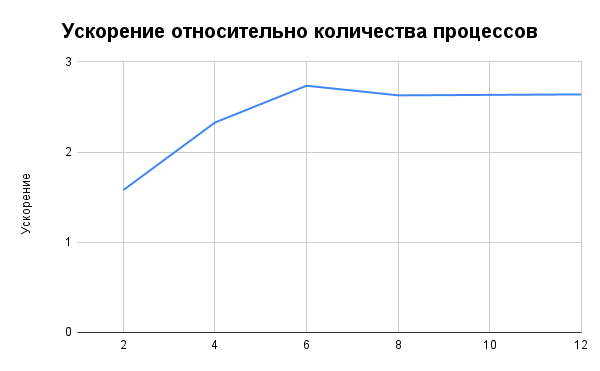
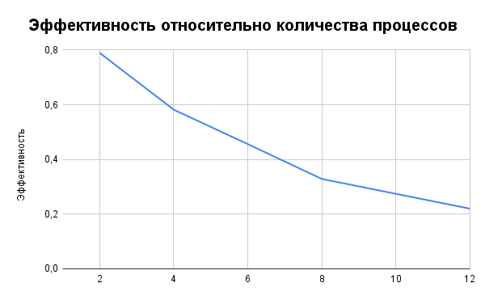

# Задание 2: определение траектории частиц

Параллельная реализация симуляции движения N частиц с использованием OpenMP. Задание выполнено только на 1 балл, без CUDA.

## Структура программы

1. **read_input(filename, n, bodies)** - чтение входных данных из файла.

Алгоритм: функция открывает входной файл и считывает количество тел, выделяет память под массив структур, последовательно считывает для каждого тела: массу, координаты (x, y) и скорости (vx, vy).

2. **compute_forces(n, bodies, fx_local, fy_local, num_threads)** - функция вычисляет гравитационные силы между всеми парами тел.

Реализация алгоритма: 
- Происходит распределение тел между потоками с помощью #pragma omp parallel for schedule(dynamic).
- Для каждого тела q вычисляются силы только с телами k, где k > q.
- Вычисляется расстояние: r = √(dx² + dy²).
- Вычисляются силы по закону Ньютона: F = G * m₁* m₂/r³ * (dx, dy).
- Применение 3-го закона Ньютона: сила на тело q равна +F, на тело k равна -F и запись сил в локальный массив текущего потока: fx_local[tid][q] и fx_local[tid][k].

3. **update_velocities_and_positions(n, bodies, fx_local, fy_local, num_threads, dt)** - обновляет скорости и координаты всех тел методом Эйлера.

Реализация алгоритма:
- #pragma omp parallel for распределяет тела между потоками
- Для каждого тела q производится суммирование сил от всех потоков, вычисление ускорения, обновление скорости (v(t+Δt) = v(t) + a*Δt) и координаты (x(t+Δt) = x(t) + v(t+Δt)*Δt) по методу Эйлера.

4. **write_output(file, t, n, bodies)** - запись координат точек в CSV-файл.

5. **Функция main()**
Основные переменные:
- tend - конечное время симуляции.
- dt = 0.01 - шаг по времени.
- t - текущее время симуляции.
- n - количество тел.
- bodies[] - массив структур Body (масса, координаты, скорости).
- num_threads - количество потоков OpenMP.
- Массивы для параллелизации: fx_local[num_threads][n] - силы по X для каждого потока и тела, fy_local[num_threads][n] - силы по Y для каждого потока и тела.

Основные функции OpenMP:
- omp_set_num_threads(num_threads) - устанавливает количество потоков для параллельных регионов.
- omp_get_max_threads() - возвращает максимально доступное количество потоков.
- omp_get_thread_num() - возвращает номер текущего потока (0, 1, 2, ...), используется для индексации в массивах.
- omp_get_wtime()- возвращает время в секундах с высокой точностью.

**Алгоритм main():**

1. Чтение параметров, чтение входного файла, выделение памяти.
2. Для каждого шага по времени:
- Вычисление сил между всеми телами (параллельно).
- Обновление скоростей и позиций (параллельно).
- Запись результатов в файл (последовательно).
3. Вывод времени выполнения, освобождение памяти.

## Замеры производительности

- **Метод замера:** omp_get_wtime()
- **Что измерялось:** Полное время выполнения симуляции.
- **Аппаратная конфигурация: процессор AMD Ryzen 5 4500, 6 ядер.**

### Результаты:

### 1. Наглядная демонстрация результатов

Программа была запущена на файле input_2.txt, где прописаны параметры для 15-ти точек: масса, координаты x и y и две составляющие скорости. В результате был создан файл output.csv (находится в папке results), где просчитаны координаты x и y для каждых 0.01 секунды в промежутке от 0 до 20 секунд. 
Далее по получившимся координатам был создан график траекторий, где можно увидеть, что алгоритм корректно просчитывает координаты точек, так как видно их взаимодействие.

### 2. Тестирование на большом количестве точек

Для подсчета времени выполнения, ускорения и эффективности, тестирование проводилось на файле input_1000.txt. Вывод времени выполнения в консоль можно увидеть в файле results_1000.txt в папке results. Формулы подсчета метрик, построение графиков можно увидеть в файле Метрики.csv в папке results.

### Выводы

1. **Успешная параллелизация.**
Реализованная стратегия распараллеливания с использованием OpenMP продемонстрировала значительное ускорение для задачи моделирования 1000 тел. Время выполнения сократилось с 25 секунд до 10 секунд (на 6 потоках), что соответствует ускорению в 2.7 раза.​

Преимущества реализованного подхода:

- Локальные массивы сил для каждого потока (fx_local[tid][]) полностью устраняют race conditions.
- Динамическое планирование (schedule(dynamic)) обеспечивает эффективную балансировку нагрузки.
- Использование 3-го закона Ньютона (вычисление только для пар k>q) сокращает объем вычислений вдвое.

2. **Оптимальные результаты для 6-ядерного процессора.**

При 6 потоках (соответствует числу физических ядер) достигается:​

- Максимальное ускорение 2.7.
- Приемлемая эффективность 45%.
- Время выполнения примерно 9.3 секунд.

Дальнейшее увеличение числа потоков (8, 12) не дает прироста производительности — время остается на уровне 10 секунд.

